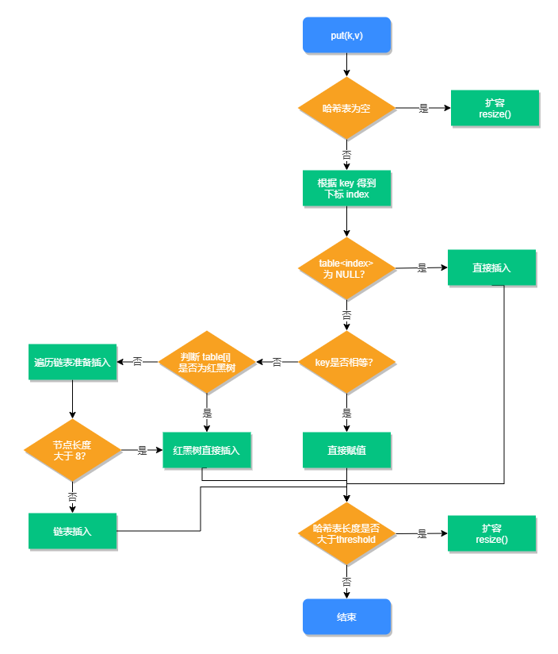

# Java源码分析--HashMap

## HashMap

在 JDK 1.7 中 HashMap 是以数组加链表的形式组成的

JDK 1.8 之后新增了红黑树的组成结构，当链表大于 8 并且容量大于 64 时，链表结构会转换成红黑树结构

```java
public class HashMap<K,V> extends AbstractMap<K,V>
    implements Map<K,V>, Cloneable, Serializable {
  
    // HashMap 初始化长度
    static final int DEFAULT_INITIAL_CAPACITY = 1 << 4; // aka 16
    // HashMap 最大长度
    static final int MAXIMUM_CAPACITY = 1 << 30; // 1073741824
    // 默认的加载因子 (扩容因子)
    static final float DEFAULT_LOAD_FACTOR = 0.75f;
    // 当链表长度大于此值且容量大于 64 时
    static final int TREEIFY_THRESHOLD = 8;
    // 转换链表的临界值，当元素小于此值时，会将红黑树结构转换成链表结构
    static final int UNTREEIFY_THRESHOLD = 6;
    // 最小树容量
    // 最小树形化容量阈值：即 当哈希表中的容量 > 该值时，才允许树形化链表 （即 将链表 转换成红黑树）
	// 否则，若桶内元素太多时，则直接扩容，而不是树形化
	// 为了避免进行扩容、树形化选择的冲突，这个值不能小于 4 * TREEIFY_THRESHOLD
    static final int MIN_TREEIFY_CAPACITY = 64;
  
  // Node
    static class Node<K,V> implements Map.Entry<K,V> {
      final int hash;
      final K key;
      V value;
      Node<K,V> next;

      Node(int hash, K key, V value, Node<K,V> next) {
        this.hash = hash;
        this.key = key;
        this.value = value;
        this.next = next;
      }

      public final K getKey()        { return key; }
      public final V getValue()      { return value; }
      public final String toString() { return key + "=" + value; }

      public final int hashCode() {
        return Objects.hashCode(key) ^ Objects.hashCode(value);
      }

      public final V setValue(V newValue) {
        V oldValue = value;
        value = newValue;
        return oldValue;
      }

      public final boolean equals(Object o) {
        if (o == this)
          return true;
        if (o instanceof Map.Entry) {
          Map.Entry<?,?> e = (Map.Entry<?,?>)o;
          if (Objects.equals(key, e.getKey()) &&
              Objects.equals(value, e.getValue()))
            return true;
        }
        return false;
      }
    }
    
    
    /** 构造方法 1 */
   public HashMap(int initialCapacity, float loadFactor) {
        if (initialCapacity < 0)
            throw new IllegalArgumentException("Illegal initial capacity: " +
                                               initialCapacity);
        if (initialCapacity > MAXIMUM_CAPACITY)
            initialCapacity = MAXIMUM_CAPACITY;
        if (loadFactor <= 0 || Float.isNaN(loadFactor))
            throw new IllegalArgumentException("Illegal load factor: " +
                                               loadFactor);
        this.loadFactor = loadFactor;
        this.threshold = tableSizeFor(initialCapacity);
    }
    public HashMap(int initialCapacity) {
        this(initialCapacity, DEFAULT_LOAD_FACTOR);
    }
    public HashMap() {
        this.loadFactor = DEFAULT_LOAD_FACTOR; // all other fields defaulted
    }
    public HashMap(Map<? extends K, ? extends V> m) {
        this.loadFactor = DEFAULT_LOAD_FACTOR;
        putMapEntries(m, false);
    }
    
}
```

### 重要方法

#### hash

```
static final int hash(Object key) {
	int h;
	return (key == null) ? 0 : (h = key.hashCode()) ^ (h >>> 16);
}
```

#### put

```java
public V put(K key, V value) {
	return putVal(hash(key), key, value, false, true);
}

```

#### putVal

```java
/**
	* Implements Map.put and related methods.
	*
	* @param hash hash for key
	* @param key the key
	* @param value the value to put
	* @param onlyIfAbsent if true, don't change existing value
	* @param evict if false, the table is in creation mode.
	* @return previous value, or null if none
	*/
final V putVal(int hash, K key, V value, boolean onlyIfAbsent, boolean evict) {
        Node<K,V>[] tab; 
  			Node<K,V> p; 
  			int n, i;
        if ((tab = table) == null || (n = tab.length) == 0)
            n = (tab = resize()).length;
        if ((p = tab[i = (n - 1) & hash]) == null)
            tab[i] = newNode(hash, key, value, null);
        else {
            Node<K,V> e; K k;
            if (p.hash == hash &&
                ((k = p.key) == key || (key != null && key.equals(k))))
                e = p;
            else if (p instanceof TreeNode)
                e = ((TreeNode<K,V>)p).putTreeVal(this, tab, hash, key, value);
            else {
                for (int binCount = 0; ; ++binCount) {
                    if ((e = p.next) == null) {
                        p.next = newNode(hash, key, value, null);
                        if (binCount >= TREEIFY_THRESHOLD - 1) // -1 for 1st
                            treeifyBin(tab, hash);
                        break;
                    }
                    if (e.hash == hash &&
                        ((k = e.key) == key || (key != null && key.equals(k))))
                        break;
                    p = e;
                }
            }
            if (e != null) { // existing mapping for key
                V oldValue = e.value;
                if (!onlyIfAbsent || oldValue == null)
                    e.value = value;
                afterNodeAccess(e);
                return oldValue;
            }
        }
        ++modCount;
        if (++size > threshold)
            resize();
        afterNodeInsertion(evict);
        return null;
    }
```

#### 图片说明




#### get

```java
public V get(Object key) {
	Node<K,V> e;
	return (e = getNode(hash(key), key)) == null ? null : e.value;
}
```

#### getNode

```java
final Node<K,V> getNode(int hash, Object key) {
    Node<K,V>[] tab; 
  	Node<K,V> first, e; 
  	int n; K k;
  	if ((tab = table) != null && (n = tab.length) > 0 &&
        (first = tab[(n - 1) & hash]) != null) {
      if (first.hash == hash && // always check first node
          ((k = first.key) == key || (key != null && key.equals(k))))
        	return first;
          if ((e = first.next) != null) {
          	if (first instanceof TreeNode)
            	return ((TreeNode<K,V>)first).getTreeNode(hash, key);
            do {
                if (e.hash == hash &&
                    ((k = e.key) == key || (key != null && key.equals(k))))
                  return e;
            } while ((e = e.next) != null);
          }
    }
    return null;
}
```

#### remove

```java
public V remove(Object key) {
        Node<K,V> e;
        return (e = removeNode(hash(key), key, null, false, true)) == null ?
            null : e.value;
    }
```


#### putMapEntries

```java
final void putMapEntries(Map<? extends K, ? extends V> m, boolean evict) {
        int s = m.size();
        if (s > 0) {
            if (table == null) { // pre-size
                float ft = ((float)s / loadFactor) + 1.0F;
                int t = ((ft < (float)MAXIMUM_CAPACITY) ?
                         (int)ft : MAXIMUM_CAPACITY);
                if (t > threshold)
                    threshold = tableSizeFor(t);
            }
            else if (s > threshold)
                resize();
            for (Map.Entry<? extends K, ? extends V> e : m.entrySet()) {
                K key = e.getKey();
                V value = e.getValue();
                putVal(hash(key), key, value, false, evict);
            }
        }
    }
```

#### removeNode

```java
final Node<K,V> removeNode(int hash, Object key, Object value,
                               boolean matchValue, boolean movable) {
        Node<K,V>[] tab; Node<K,V> p; int n, index;
        if ((tab = table) != null && (n = tab.length) > 0 &&
            (p = tab[index = (n - 1) & hash]) != null) {
            Node<K,V> node = null, e; K k; V v;
            if (p.hash == hash &&
                ((k = p.key) == key || (key != null && key.equals(k))))
                node = p;
            else if ((e = p.next) != null) {
                if (p instanceof TreeNode)
                    node = ((TreeNode<K,V>)p).getTreeNode(hash, key);
                else {
                    do {
                        if (e.hash == hash &&
                            ((k = e.key) == key ||
                             (key != null && key.equals(k)))) {
                            node = e;
                            break;
                        }
                        p = e;
                    } while ((e = e.next) != null);
                }
            }
            if (node != null && (!matchValue || (v = node.value) == value ||
                                 (value != null && value.equals(v)))) {
                if (node instanceof TreeNode)
                    ((TreeNode<K,V>)node).removeTreeNode(this, tab, movable);
                else if (node == p)
                    tab[index] = node.next;
                else
                    p.next = node.next;
                ++modCount;
                --size;
                afterNodeRemoval(node);
                return node;
            }
        }
        return null;
    }
```


### 其他重要方法

#### containsKey

```java
public boolean containsKey(Object key) {
	return getNode(hash(key), key) != null;
}
```

#### containsValue

```java
public boolean containsValue(Object value) {
    Node<K,V>[] tab; V v;
    if ((tab = table) != null && size > 0) {
    	for (int i = 0; i < tab.length; ++i) {
    		for (Node<K,V> e = tab[i]; e != null; e = e.next) {
    			if ((v = e.value) == value ||
    					(value != null && value.equals(v)))
    				return true;
    			}
    		}
    }
    return false;
}
```


#### size

```java
public int size() {
		return size;
}		
```

#### resize

```java
final Node<K,V>[] resize() {
        Node<K,V>[] oldTab = table;
        int oldCap = (oldTab == null) ? 0 : oldTab.length;
        int oldThr = threshold;
        int newCap, newThr = 0;
        if (oldCap > 0) {
            if (oldCap >= MAXIMUM_CAPACITY) {
                threshold = Integer.MAX_VALUE;
                return oldTab;
            }
            else if ((newCap = oldCap << 1) < MAXIMUM_CAPACITY &&
                     oldCap >= DEFAULT_INITIAL_CAPACITY)
                newThr = oldThr << 1; // double threshold
        }
        else if (oldThr > 0) // initial capacity was placed in threshold
            newCap = oldThr;
        else {               // zero initial threshold signifies using defaults
            newCap = DEFAULT_INITIAL_CAPACITY;
            newThr = (int)(DEFAULT_LOAD_FACTOR * DEFAULT_INITIAL_CAPACITY);
        }
        if (newThr == 0) {
            float ft = (float)newCap * loadFactor;
            newThr = (newCap < MAXIMUM_CAPACITY && ft < (float)MAXIMUM_CAPACITY ?
                      (int)ft : Integer.MAX_VALUE);
        }
        threshold = newThr;
        @SuppressWarnings({"rawtypes","unchecked"})
        Node<K,V>[] newTab = (Node<K,V>[])new Node[newCap];
        table = newTab;
        if (oldTab != null) {
            for (int j = 0; j < oldCap; ++j) {
                Node<K,V> e;
                if ((e = oldTab[j]) != null) {
                    oldTab[j] = null;
                    if (e.next == null)
                        newTab[e.hash & (newCap - 1)] = e;
                    else if (e instanceof TreeNode)
                        ((TreeNode<K,V>)e).split(this, newTab, j, oldCap);
                    else { // preserve order
                        Node<K,V> loHead = null, loTail = null;
                        Node<K,V> hiHead = null, hiTail = null;
                        Node<K,V> next;
                        do {
                            next = e.next;
                            if ((e.hash & oldCap) == 0) {
                                if (loTail == null)
                                    loHead = e;
                                else
                                    loTail.next = e;
                                loTail = e;
                            }
                            else {
                                if (hiTail == null)
                                    hiHead = e;
                                else
                                    hiTail.next = e;
                                hiTail = e;
                            }
                        } while ((e = next) != null);
                        if (loTail != null) {
                            loTail.next = null;
                            newTab[j] = loHead;
                        }
                        if (hiTail != null) {
                            hiTail.next = null;
                            newTab[j + oldCap] = hiHead;
                        }
                    }
                }
            }
        }
        return newTab;
    }
```


#### isEmpty

```java
public boolean isEmpty() {
  	return size == 0;
}
```

#### clear

```java
public void clear() {
        Node<K,V>[] tab;
        modCount++;
        if ((tab = table) != null && size > 0) {
            size = 0;
            for (int i = 0; i < tab.length; ++i)
                tab[i] = null;
        }
    }
```


## 知识点

### HashMap特点

+ HashMap是基于哈希表的Map接口实现。

+ HashMap底层采用的是Entry数组和链表实现。

+ HashMap是采用key-value形式存储，
  + 其中key是可以允许为null但是只能是一个，并且key不允许重复(如果重复则新值覆盖旧值)。

+ HashMap是线程不安全的。
+ HashMap存入的顺序和遍历的顺序有可能是不一致的。
+ HashMap保存数据的时候通过计算key的hash值来去决定存储的位置。


### 什么是加载因子？加载因子为什么是 0.75？

+ 加载因子也叫扩容因子或负载因子，用来判断什么时候进行扩容的
  + 假如加载因子是 0.5，
  + HashMap 的初始化容量是 16，
  + 那么当 HashMap 中有 16*0.5=8 个元素时，HashMap 就会进行扩容。
+ 那加载因子为什么是 0.75 而不是 0.5 或者 1.0 呢？
  + 当加载因子设置比较大的时候，
    + 扩容的门槛就被提高了，扩容发生的频率比较低
    + 占用的空间会比较小，但此时发生 Hash 冲突的几率就会提升
    + 因此需要更复杂的数据结构来存储元素，这样对元素的操作时间就会增加，运行效率也会因此降低
  + 当加载因子值比较小的时候
    + 扩容的门槛会比较低，因此会占用更多的空间，此时元素的存储就比较稀疏
    + 发生哈希冲突的可能性就比较小，因此操作性能会比较高。
+ 0.75出于容量和性能之间平衡的结果


### transient关键字

+ transient修饰，那就说明这个数组是不会被序列化的
+ 集合HashMap与ArrayList都自定义了独自的序列化方式
  + HashMap的源码里面自定义了序列化和反序列化的方法
  + 序列化方法主要是把当前HashMap的buckets数量，size和里面的k,v对一一给写到了对象输出流里面
  + 反序列化的时候，再从流里面一一的解析出来，然后又重新恢复出了HashMap的整个数据结构。

#### HashMap自定义的序列化的代码：

```java
//1
    private void writeObject(java.io.ObjectOutputStream s)
        throws IOException {
        int buckets = capacity();
        // Write out the threshold, loadfactor, and any hidden stuff
        s.defaultWriteObject();
        s.writeInt(buckets);
        s.writeInt(size);
        internalWriteEntries(s);
    }
//2    
 public void internalWriteEntries(java.io.ObjectOutputStream s) throws IOException {
        Node<K,V>[] tab;
        if (size > 0 && (tab = table) != null) {
            for (int i = 0; i < tab.length; ++i) {
                for (Node<K,V> e = tab[i]; e != null; e = e.next) {
                    s.writeObject(e.key);
                    s.writeObject(e.value);
                }
            }
        }
    } 
```

#### HashMap自定义的反序列化的代码：

```java
//1
   private void readObject(java.io.ObjectInputStream s)
        throws IOException, ClassNotFoundException {
        // Read in the threshold (ignored), loadfactor, and any hidden stuff
        s.defaultReadObject();
        reinitialize();
        if (loadFactor <= 0 || Float.isNaN(loadFactor))
            throw new InvalidObjectException("Illegal load factor: " +
                                             loadFactor);
        s.readInt();                // Read and ignore number of buckets
        int mappings = s.readInt(); // Read number of mappings (size)
        if (mappings < 0)
            throw new InvalidObjectException("Illegal mappings count: " +
                                             mappings);
        else if (mappings > 0) { // (if zero, use defaults)
            // Size the table using given load factor only if within
            // range of 0.25...4.0
            float lf = Math.min(Math.max(0.25f, loadFactor), 4.0f);
            float fc = (float)mappings / lf + 1.0f;
            int cap = ((fc < DEFAULT_INITIAL_CAPACITY) ?
                       DEFAULT_INITIAL_CAPACITY :
                       (fc >= MAXIMUM_CAPACITY) ?
                       MAXIMUM_CAPACITY :
                       tableSizeFor((int)fc));
            float ft = (float)cap * lf;
            threshold = ((cap < MAXIMUM_CAPACITY && ft < MAXIMUM_CAPACITY) ?
                         (int)ft : Integer.MAX_VALUE);
            @SuppressWarnings({"rawtypes","unchecked"})
                Node<K,V>[] tab = (Node<K,V>[])new Node[cap];
            table = tab;

            // Read the keys and values, and put the mappings in the HashMap
            for (int i = 0; i < mappings; i++) {
                @SuppressWarnings("unchecked")
                    K key = (K) s.readObject();
                @SuppressWarnings("unchecked")
                    V value = (V) s.readObject();
                putVal(hash(key), key, value, false, false);
            }
        }
    }
```


