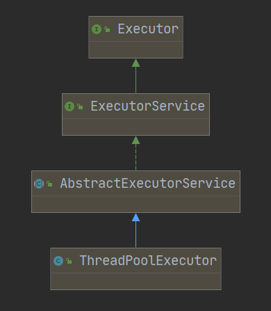

# Java源码分析--ThreadPoolExecutor

## ThreadPoolExecutor

线程池的使用必须要通过 ThreadPoolExecutor 的方式来创建，这样才可以更加明确线程池的运行规则，规避资源耗尽的风险。

### SourceCode

```java
// 构造
public ThreadPoolExecutor(int corePoolSize,
                          int maximumPoolSize,
                          long keepAliveTime,
                          TimeUnit unit,
                          BlockingQueue<Runnable> workQueue,
                          ThreadFactory threadFactory,
                          RejectedExecutionHandler handler) {
    if (corePoolSize < 0 ||
        // maximumPoolSize 必须大于 0，且必须大于 corePoolSize
        maximumPoolSize <= 0 ||
        maximumPoolSize < corePoolSize ||
        keepAliveTime < 0)
        throw new IllegalArgumentException();
    if (workQueue == null || threadFactory == null || handler == null)
        throw new NullPointerException();
    this.acc = System.getSecurityManager() == null ?
            null :
            AccessController.getContext();
    this.corePoolSize = corePoolSize;
    this.maximumPoolSize = maximumPoolSize;
    this.workQueue = workQueue;
    this.keepAliveTime = unit.toNanos(keepAliveTime);
    this.threadFactory = threadFactory;
    this.handler = handler;
}

// excute方法
public void execute(Runnable command) {
    if (command == null)
        throw new NullPointerException();
    int c = ctl.get();
    // 当前工作的线程数小于核心线程数
    if (workerCountOf(c) < corePoolSize) {
        // 创建新的线程执行此任务
        if (addWorker(command, true))
            return;
        c = ctl.get();
    }
    // 检查线程池是否处于运行状态，如果是则把任务添加到队列
    if (isRunning(c) && workQueue.offer(command)) {
        int recheck = ctl.get();
        // 再出检查线程池是否处于运行状态，防止在第一次校验通过后线程池关闭
        // 如果是非运行状态，则将刚加入队列的任务移除
        if (! isRunning(recheck) && remove(command))
            reject(command);
        // 如果线程池的线程数为 0 时（当 corePoolSize 设置为 0 时会发生）
        else if (workerCountOf(recheck) == 0)
            addWorker(null, false); // 新建线程执行任务
    }
    // 核心线程都在忙且队列都已爆满，尝试新启动一个线程执行失败
    else if (!addWorker(command, false)) 
        // 执行拒绝策略
        reject(command);
}
```


### 图片说明


### 其他重要方法


## 知识点

### 参数说明

+ 第 1 个参数：
  + corePoolSize 表示线程池的常驻核心线程数。
    + 如果设置为 0，则表示在没有任何任务时，销毁线程池；
    + 如果大于 0，即使没有任务时也会保证线程池的线程数量等于此值。
    + 但需要注意，此值
    + 如果设置的比较小，则会频繁的创建和销毁线程（创建和销毁的原因会在本课时的下半部分讲到）；
    + 如果设置的比较大，则会浪费系统资源，所以开发者需要根据自己的实际业务来调整此值。

+ 第 2 个参数：
  + maximumPoolSize 表示线程池在任务最多时，最大可以创建的线程数。
    + 官方规定此值必须大于 0，也必须大于等于 corePoolSize，
    + 此值只有在任务比较多，且不能存放在任务队列时，才会用到。

+ 第 3 个参数：
  + keepAliveTime 表示线程的存活时间
    + 当线程池空闲时并且超过了此时间，多余的线程就会销毁，直到线程池中的线程数量销毁的等于 corePoolSize 为止，
    + 如果 maximumPoolSize 等于 corePoolSize，那么线程池在空闲的时候也不会销毁任何线程。

+ 第 4 个参数：
  + unit 表示存活时间的单位，
    + 它是配合 keepAliveTime 参数共同使用的。

+ 第 5 个参数：
  + workQueue 表示线程池执行的任务队列
    + 当线程池的所有线程都在处理任务时，
    + 如果来了新任务就会缓存到此任务队列中排队等待执行。

+ 第 6 个参数：
  + threadFactory 表示线程的创建工厂
    + 此参数一般用的比较少，我们通常在创建线程池时不指定此参数，它会使用默认的线程创建工厂的方法来创建线程
+ 第 7 个参数：
  + RejectedExecutionHandler 表示指定线程池的拒绝策略
    + 当线程池的任务已经在缓存队列 workQueue 中存储满了之后
    + 并且不能创建新的线程来执行此任务时，就会用到此拒绝策略，它属于一种限流保护的机制。


### execute() VS submit()

+ execute() 和 submit() 都是用来执行线程池任务的，
  + 它们最主要的区别是，
    + submit() 方法可以接收线程池执行的返回值
    + execute() 不能接收返回值

```java
ThreadPoolExecutor executor = new ThreadPoolExecutor(2, 10, 10L,
        TimeUnit.SECONDS, new LinkedBlockingQueue(20));
// execute 使用
executor.execute(new Runnable() {
    @Override
    public void run() {
        System.out.println("Hello, execute.");
    }
});
// submit 使用
Future<String> future = executor.submit(new Callable<String>() {
    @Override
    public String call() throws Exception {
        System.out.println("Hello, submit.");
        return "Success";
    }
});
System.out.println(future.get());
```



### 线程池的拒绝策略

Java 自带的拒绝策略有 4 种：

+ AbortPolicy，终止策略，线程池会抛出异常并终止执行，它是默认的拒绝策略
+ CallerRunsPolicy，把任务交给当前线程来执行
+ DiscardPolicy，忽略此任务（最新的任务）
+ DiscardOldestPolicy，忽略最早的任务（最先加入队列的任务）。